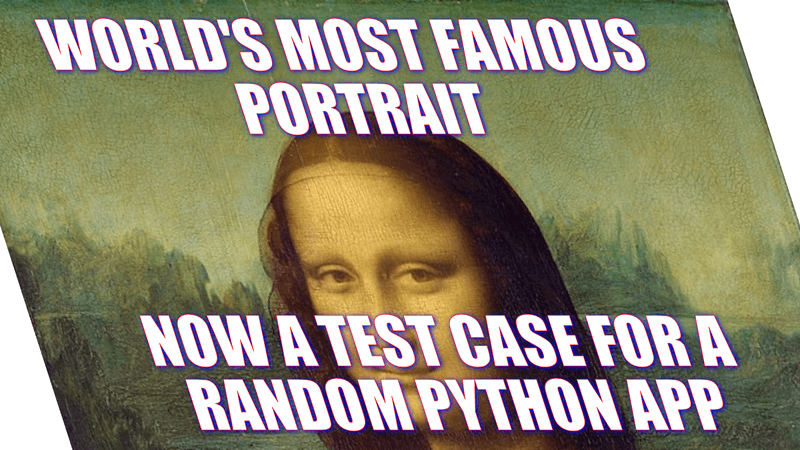
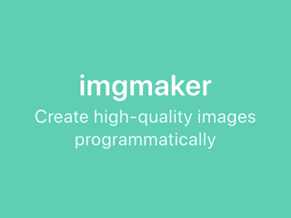
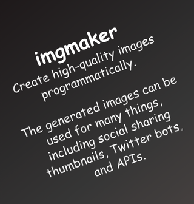

# imgmaker



Create high-quality images programmatically using easily-hackable templates.

imgmaker is a Python package that leverages headless [Google Chrome](https://www.google.com/chrome/) via [selenium](https://selenium-python.readthedocs.io) for image generation, which counterintuitively has many benefits:

- Renders images at Retina resolution (2x DPI) for improved image/text quality, and downsamples them by default for further improved antialiasing.
- Templates are just HTML and CSS, allowing them to be tweaked even by designers.
- Since the CSS is responsive, you get conditional image adjustments based on the image width without additional code flows.
- Optional dynamic image height to fit whatever text is provided.
- Leverages [jinja2](https://palletsprojects.com/p/jinja/) for Python templating, [Bulma](https://bulma.io) for high-quality CSS-only layouts, and [Font Awesome](https://fontawesome.com) for icon fonts.

imgmaker contains installed templates, allowing you to create [memes](https://imgmaker.minimaxir.com/meme/) and [watermarks](https://imgmaker.minimaxir.com/watermark/) out of the box. The generated images can be used for many things, including social sharing thumbnails, Twitter bots, and APIs. Please read [the documentation](https://imgmaker.minimaxir.com) for more info!

## Installation

imgmaker can be installed from PyPI via pip. (Python 3.6+)

```sh
pip3 install imgmaker
```

You will also need to download a [ChromeDriver](https://chromedriver.chromium.org) with the _same_ version as your installed Google Chrome. imgmaker has a CLI tool that will automatically download the ChromeDriver for your platform corresponding to the latest `stable` version to the current directory:

```sh
imgmaker chromedriver
```

## Usage

First, you can instantiate an `imgmaker` object, which starts up a headless Google Chrome in the background.

```python
from imgmaker import imgmaker

i = imgmaker()
```

imgmaker contains built-in templates (you can view all the templates in the documentation, with specs/usage tutorials for each one). We'll use the [Hero](https://imgmaker.minimaxir.com/hero/) template; the default used if no template is specified.

```python
i.generate()
```


We can pass a dictionary containing template parameters to `generate()`. For the Hero template, we can specify the title and subtitle.

```python
i.generate(
    "hero",
    {"title": "imgmaker",
     "subtitle": "Create high-quality images programmatically"
    },
)
```



You can also alter the background `color` [matching the Bulma documentation](https://bulma.io/documentation/layout/hero/) (e.g. `info`, `success`), use the `bold` background variant instead, set the image to a dynamic height to fit all the text, and/or _use custom CSS and go crazy_.

```python
i.generate(
    "hero",
    {"title": "imgmaker",
     "subtitle": "Create high-quality images programmatically.<br /><br />" +
                 "The generated images can be used for many things, " +
                 "including social sharing thumbnails, Twitter bots, and APIs.",
     "color": "dark",
     "bold": True,
     "custom_css": ".container {font-family: Comic Sans MS; transform: rotate(-20deg);}"
    },
    height = -1,
)
```



You can also create and provide your own Jinja templates to `generate()`; see [this doc](https://imgmaker.minimaxir.com/template/) for a tutorial.

When you are done, it's recommended to close the created Google Chrome instance, otherwise they will hang around and accumulate:

```python
i.close()
```

Or you can take the thermonuclear option and kill _all_ chromedrivers and Chrome instances from the command line.

```
imgmaker kill-all-chrome
```

## Helpful Notes

- Yes, using Google Chrome automation is a galaxy-brain approach toward programmatic image generation. However, the feature robustness of Chrome and hackability it allows far outweights the "weight" of Chrome, and it would take substantially more code to natively replicate, especially cross-platform.
- If you want to intentionally create Retina (2x DPI) or higher assets, you can disable downsampling by passing `downsampling=False` to `generate()`. Additionally, you can pass a `scale` value to the `imgmaker()` constructor (e.g. `imgmaker(scale=6)`) for _very_ high-resolution pictures!
- Do not use `custom_css` with id-level rules; this causes the ChromeDriver to hang for whatever reason.

## To-Do

I made imgmaker more as a proof-of-concept, as I have a few projects where this package could be very useful. If there is user-interest, I have more features planned:

- Add a Docker container + an app to deploy (e.g. to Cloud Run)
- Optimize included HTML + CSS templates
  - Use local CSS/font files for included templates
- Add more templates! (as needs/community demand arise)

## Maintainer/Creator

Max Woolf ([@minimaxir](https://minimaxir.com))

_Max's open-source projects are supported by his [Patreon](https://www.patreon.com/minimaxir) and [GitHub Sponsors](https://github.com/sponsors/minimaxir). If you found this project helpful, any monetary contributions to the Patreon are appreciated and will be put to good creative use._

## License

MIT
