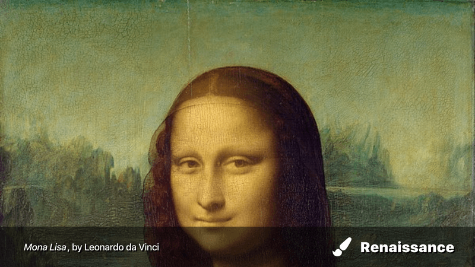
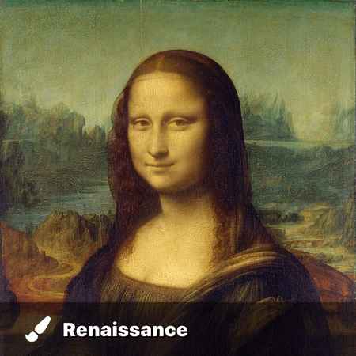

A template invoking a simple watermark on an image, inspired by Reddit's [new watermarking template](https://www.reddit.com/r/assholedesign/comments/e1d50c/reddit_watermarking_any_image_you_save_off_the_app/). But with a twist.

## Dimensions

800px x 450px

You will likely need to manually determine the width/height before passing them to `generate()`

## Parameters

| Name         | Description                                              | Default                                              |
| ------------ | -------------------------------------------------------- | ---------------------------------------------------- |
| `left_text`  | Left text for the watermark                              | `"Made by **me**!"`                                  |
| `fa_icon`    | Font Awesome icon                                        | `"fas fa-laptop-house`                               |
| `brand_text` | Text of the brand.                                       | `"My brand!"`                                        |
| `background` | Image of the meme (URL or local path.)                   | [Mona Lisa](https://en.wikipedia.org/wiki/Mona_Lisa) |
| `custom_css` | Custom CSS; refer to the raw template for HTML elements. | Empty                                                |

## Example Usage

(note: due to file-size [about 500KB per image], the images included on this page have been compressed using [TinyPNG](https://tinypng.com))

Set up imgmaker:

```python
from imgmaker import imgmaker

i = imgmaker()
```

No configuration:

```python
i.generate("watermark")
```


Change the text and the icon.

```python
i.generate(
    "watermark",
    {"left_text": "_Mona Lisa_, by Leonardo da Vinci",
     "fa_icon": "fas fa-paint-brush",
     "brand_text": "Renaissance"
    },
)
```


This template is responsive: if the width is less than 768px, to avoid text overlap, only the brand + icon will display.

```python
i.generate(
    "watermark",
    {"left_text": "_Mona Lisa_, by Leonardo da Vinci",
     "fa_icon": "fas fa-paint-brush",
     "brand_text": "Renaissance"
    },
    width=450
)
```


